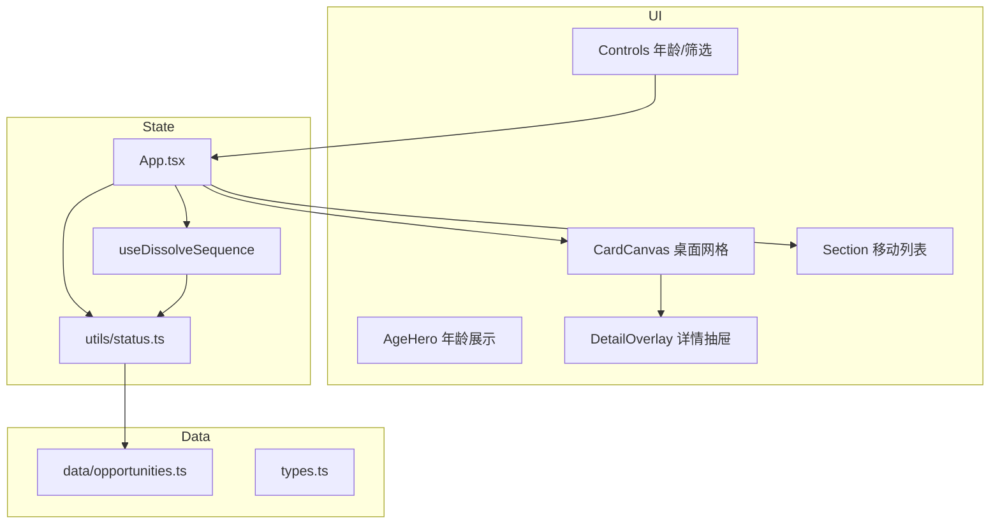
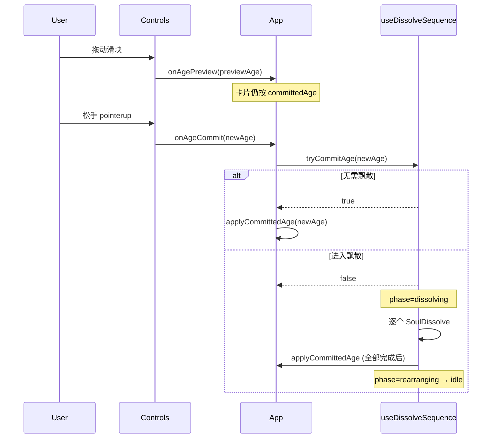

# 时光窗口 · 技术架构文档

> 版本：v0.2 | 更新：2026-05-21  
> 读者：开发者、维护者、AI 助手

---

## 1. 系统概览



| 项 | 选型 |
|----|------|
| 运行时 | React 19 + TypeScript 5.8 |
| 构建 | Vite 6 + `@vitejs/plugin-react` |
| 样式 | Tailwind CSS v4（`@tailwindcss/vite`） |
| 动画 | Framer Motion |
| 图标 | Lucide React |
| 数据 | 静态 TS 数组，构建时打包 |

---

## 2. 领域模型

### 2.1 Opportunity（人生窗口条目）

定义见 `src/types.ts`，数据见 `src/data/opportunities.ts`（`op-001` … `op-040`）。

```typescript
interface Opportunity {
  id: string
  title: string
  category: Category      // language | education | location | ...
  importance: Importance  // critical | high | medium
  description: string
  window: {
    best: [number, number]    // 最佳期年龄闭区间
    still: [number, number]   // 仍可期（still[1] 为仍可期上限）
    closedAfter: number       // 文档用，计算以 still[1] 为准
  }
  alternatives: string[]      // 补救路径，closed 时尤其重要
  note?: string               // 个体差异免责声明
}
```

### 2.2 WindowStatus（四态）

由 `getWindowStatus(age, window)` 计算，**与条目 id 无关，仅与年龄有关**：

| 状态 | 条件 | UI 色（约） |
|------|------|-------------|
| `upcoming` | `age < best[0]` | 天蓝 |
| `open` | `best[0] ≤ age ≤ best[1]` | 绿色 |
| `closing` | `best[1] < age ≤ still[1]` | 琥珀 |
| `closed` | `age > still[1]` | 灰 |

派生类型：`CardItem = Opportunity & { status: WindowStatus }`。

### 2.3 区间探索模式

`rangeMode === true` 时：

- 筛选与 `[rangeStart, rangeEnd]` **有交集** 的条目（`overlapsRange`）
- 对区间内每个整数年龄算状态，取优先级：`open > closing > upcoming > closed`
- **不触发**「已关飘散」序列（`tryCommitAge` 直接返回 true）

---

## 3. 年龄状态管理（App 层）

### 3.1 双年龄

```typescript
const [committedAge, setCommittedAge] = useState(loadAge)  // 卡片逻辑基准
const [previewAge, setPreviewAge] = useState(loadAge)      // 滑块/ Hero 显示
```

| 事件 | previewAge | committedAge |
|------|------------|--------------|
| 滑块拖动 `onChange` | 更新 | 不变 |
| 滑块 `pointerup` → `handleAgeCommit` | 更新 | 见飘散逻辑 |
| 飘散全部完成 `applyCommittedAge` | 同步 | 更新为新年龄 |

`localStorage` 键：`life-windows-age`，在 `applyCommittedAge` 时写入。

### 3.2 提交流程



---

## 4. 已关飘散状态机（`useDissolveSequence`）

**文件：** `src/hooks/useDissolveSequence.ts`

### 4.1 Phase

| Phase | 含义 |
|-------|------|
| `idle` | 正常浏览，`canvasItems` 来自 `committedAge` |
| `dissolving` | 冻结 `frozenItems` 布局，逐个播放飘散 |
| `rearranging` | 已应用新年龄，剩余卡片 spring 重排（约 520ms） |

### 4.2 检测「新关闭」（关键业务规则）

```typescript
const prevItems = computeItems(committedAge, ...)   // 上次已提交年龄
const nextItems = computeItems(newAge, ...)         // 本次松手年龄

const newlyClosed = nextItems.filter((o) => {
  const was = prevStatus.get(o.id)
  return o.status === 'closed' && was !== undefined && was !== 'closed'
})
```

- **对比基准**：`committedAge` → `newAge`，不是 0 岁，不是 `nextItems` 里全部 `closed`
- `dissolveRun.queue` = 按 **冻结快照网格顺序** 排列的 `newlyClosed` id 列表

### 4.3 冻结快照

```typescript
const snapshot = filterVisible(prevItems, onlyActionable)
// 与松手前用户看到的卡片一致；已关飘散模式下旧已关本就不显示

const snapshotWithClosed = snapshot.map((item) =>
  closedIdSet.has(item.id) ? { ...item, status: 'closed' } : item,
)
setFrozenItems(snapshotWithClosed)
```

**常见 Bug：** 使用 `filterVisible(prevItems, false)`（在已开「仅可做」时）会把历史已关卡片重新塞进网格，导致「提示 N 个、页面很多张」。

### 4.4 逐个飘散

- `activeDissolveId` = `queue[doneCount]`（同一时刻只有一个）
- `vanishedIds` = `queue.slice(0, doneCount)` → 网格内留空占位，**不触发重排**
- `completeDissolve(id)` 必须匹配 `expected` id，防止乱序回调
- 全部完成后 `finishSequence()` → `onAgeAppliedRef(age)` → `phase = rearranging`

### 4.5 对外 API

```typescript
const {
  phase,
  canvasItems,           // 当前应渲染的卡片列表
  activeDissolveId,
  vanishedIds,
  pendingDissolveIds,    // = queue 全集，用于 waiting 样式
  dissolveProgress,      // { done, step (1-based), total, fromAge, toAge }
  tryCommitAge,
  completeDissolve,
  layoutFrozen,          // dissolving 时为 true
  layoutAnimating,       // rearranging 时为 true
  isBusy,
} = useDissolveSequence({ ... })
```

---

## 5. UI 架构

### 5.1 桌面（`lg+`）

```
┌─────────────────────────────────────────────────────────┐
│ Header + Controls (previewAge, commit on pointerup)      │
├──────────┬──────────────────────────────────────────────┤
│ AgeHero  │  CardCanvas (CSS Grid, CompactCard)          │
│ Summary  │  → click → DetailOverlay (右侧抽屉)          │
└──────────┴──────────────────────────────────────────────┘
```

- `CardCanvas`：`layoutFrozen` 时禁止排序与 `popLayout`；`vanishedIds` 渲染空占位
- `CompactCard`：默认标题 + 简介截断；详情在 `DetailOverlay`

### 5.2 移动（`< lg`）

- `Section` 按状态分区：开放 → 将关 → 未来 → 已关
- `OpportunityCard`：可展开说明与补救列表
- 飘散时仅 `pendingDissolveIds` 内条目走 `SoulDissolveWrapper`（见 closed Section）

### 5.3 动画组件

| 组件 | 职责 |
|------|------|
| `SoulDissolveWrapper` | 粒子上升 + 卡片缩放淡出；`delay` 支持串行；尊重 `prefers-reduced-motion` |
| `DualRangeSlider` | 区间模式双拇指滑块；`onCommit` on pointerup |

---

## 6. 筛选与可见性

`filterVisible(items, onlyActionable)`：`onlyActionable && status === 'closed'` 时过滤掉。

`canvasItems` 在 `idle` 时：先 `filterVisible(committedItems, ...)` 再按状态排序。

---

## 7. 依赖关系图（简化）

```
opportunities.ts
       ↓
types.ts ← status.ts
       ↓
useDissolveSequence ← App.tsx → Controls / CardCanvas / Section / DetailOverlay
       ↑
category-style.ts, cn.ts
```

**改内容的默认路径：** 只改 `src/data/opportunities.ts`。  
**改交互的默认路径：** `App.tsx` + `useDissolveSequence.ts` + 相关组件。

---

## 8. 构建与部署

```bash
npm run build   # tsc -b && vite build → dist/
npm run preview # 本地预览 dist
```

环境要求：Node 20（见 `package.json` engines），npm。

### Cloudflare Pages

- **输出目录必须为 `dist`**，否则会部署开发版 `index.html`（`/src/main.tsx`），触发模块 MIME 错误。
- 根目录 `wrangler.toml` 声明 `pages_build_output_dir = "dist"`。
- `public/_headers` 在构建后位于 `dist/_headers`，为 `.js` 等资源设置 `text/javascript`。

---

## 9. 扩展指南

| 需求 | 建议改动位置 |
|------|----------------|
| 新增人生窗口 | `data/opportunities.ts` 追加条目 |
| 调整年龄区间 | 同上 `window.best` / `window.still` |
| 新筛选维度 | `types.ts` + `Controls` + `App` 筛选 memo |
| 改掉飘散逻辑 | `useDissolveSequence.ts` + `CardCanvas` + 本文档 §4 |
| CMS 后台 | 新增 API 层，替换静态 import；Out of MVP scope |

---

## 10. 相关文档

- [MVP.md](./MVP.md) — 产品边界与伦理
- [../AGENTS.md](../AGENTS.md) — AI 协作速查
